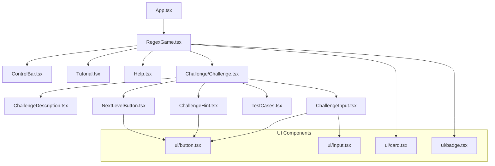

```mermaid
graph TD
    App[App.tsx] --> RegexGame[RegexGame.tsx]
    RegexGame --> ControlBar[ControlBar.tsx]
    RegexGame --> Tutorial[Tutorial.tsx]
    RegexGame --> Help[Help.tsx]
    RegexGame --> Challenge[Challenge/Challenge.tsx]
    
    Challenge --> ChallengeDescription[ChallengeDescription.tsx]
    Challenge --> ChallengeInput[ChallengeInput.tsx]
    Challenge --> ChallengeHint[ChallengeHint.tsx]
    Challenge --> TestCases[TestCases.tsx]
    Challenge --> NextLevelButton[NextLevelButton.tsx]

    subgraph UI Components
        Button[ui/button.tsx]
        Input[ui/input.tsx]
        Card[ui/card.tsx]
        Badge[ui/badge.tsx]
    end

    ChallengeInput --> Button
    ChallengeInput --> Input
    RegexGame --> Card
    RegexGame --> Badge
    ChallengeHint --> Button
    NextLevelButton --> Button
```
